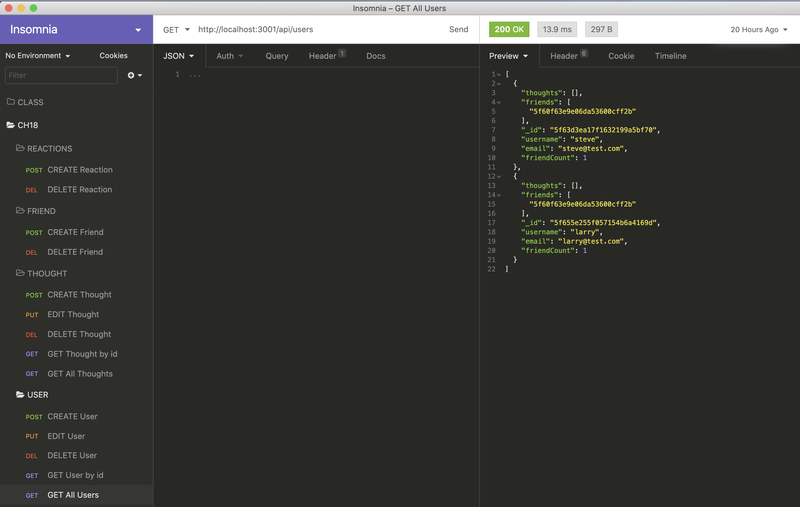

# challenge18_SocialNetwork

[JB BLOT - SOCIAL NETWORK API](https://github.com/jaaybe/challenge18_SocialNetwork)

## Description
I've built an API for a social network web application where users can share their thoughts, react to friends’ thoughts, and create a friend list. I've used Express.js for routing, a MongoDB database, and the Mongoose ODM. In addition to using the Express.js and Mongoose packages, I've used the Moment.js package to format time.

## Technology Used
<ul>
<li>git</li>
<li>API</li>
<li>Javascript</li>
<li>NoSQL / MongoDb</li>
<li>Mongoose</li>
<li>Node</li>
<li>Express</li>